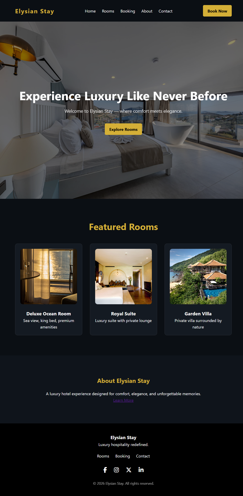
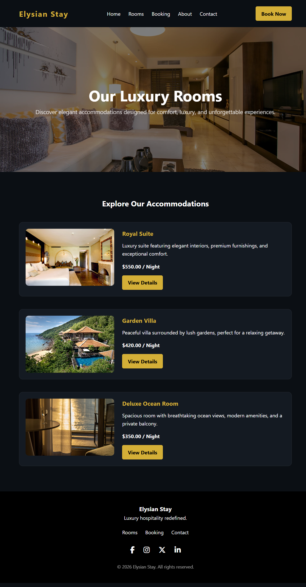
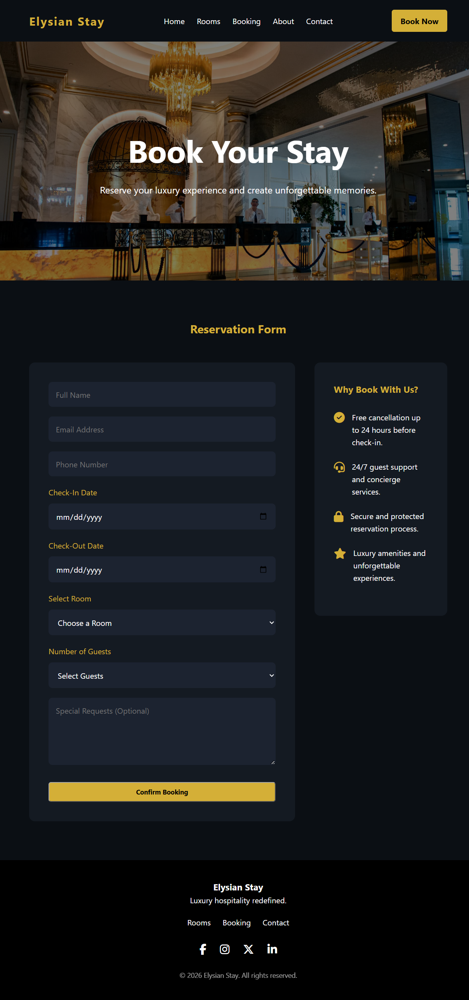
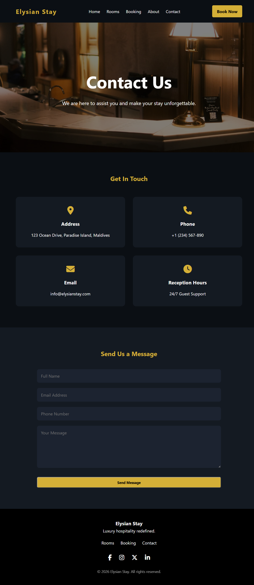
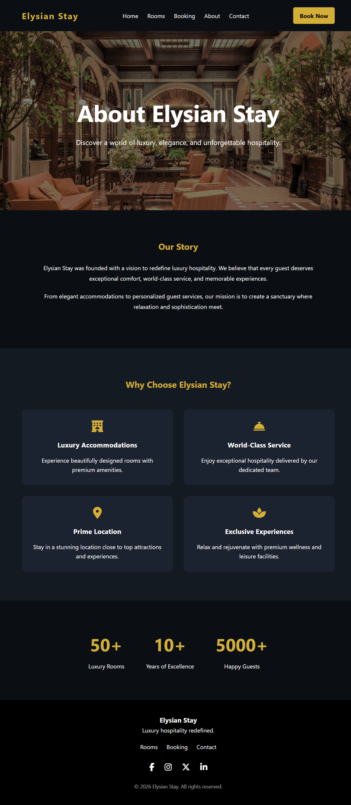
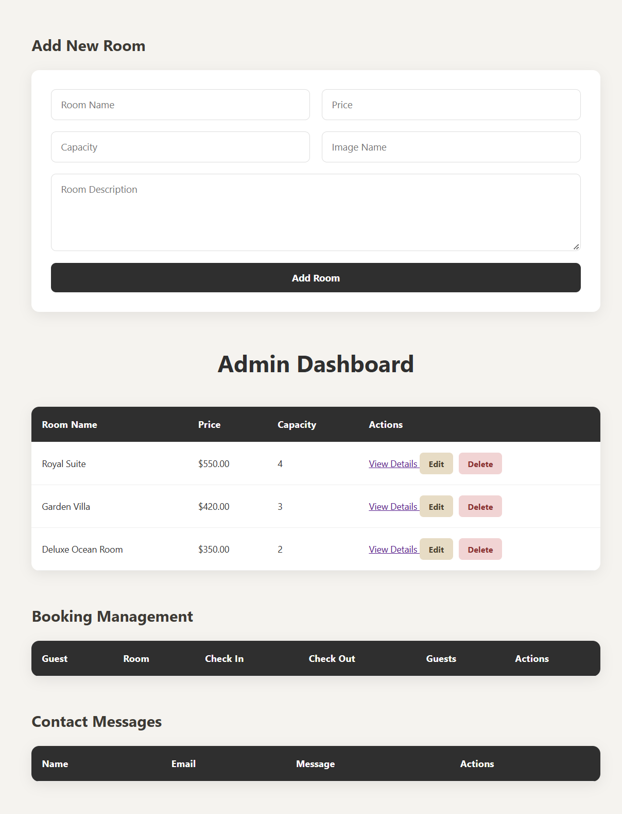

# Elysian Stay

Ein modernes Full-Stack-Hotelbuchungssystem für ein luxuriöses Hotelerlebnis.

Elysian Stay ermöglicht Gästen, die verfügbaren Unterkünfte zu erkunden, Zimmerdetails anzusehen, Buchungsanfragen zu senden und das Hotel zu kontaktieren. Das Projekt verfügt außerdem über ein Administrations-Dashboard zur Verwaltung von Zimmern, Buchungen und Kundennachrichten.

## Funktionen

### Gäste-Bereich

* Moderne und responsive Benutzeroberfläche im Luxury-Hotel-Stil
* Hero-Bild-Slideshow auf der Startseite
* Bereich mit ausgewählten Zimmern
* Dynamisches Laden der Zimmerdaten aus PostgreSQL
* Dynamische Zimmerdetails
* Anzeige der Zimmerkapazität
* Buchungsformular mit dynamischer Zimmerauswahl
* Gästeauswahl basierend auf der Zimmerkapazität
* Kontaktformular
* Responsive Design für Desktop und mobile Geräte

### Buchungssystem

* Buchungsformular für Gäste
* Check-in- und Check-out-Daten
* Dynamische Zimmerauswahl
* Auswahl der Gästeanzahl
* Möglichkeit für besondere Wünsche
* Speicherung der Buchungsdaten in PostgreSQL

### Administrations-Dashboard

* Alle Zimmer anzeigen
* Neue Zimmer hinzufügen
* Bestehende Zimmer bearbeiten
* Zimmer löschen
* Zimmerdetails anzeigen
* Kundenbuchungen anzeigen
* Buchungen löschen
* Kundennachrichten anzeigen
* Nachrichten löschen

> **Hinweis:** Das aktuelle Administrations-Dashboard verfügt noch nicht über eine Authentifizierung. Eine Admin-Authentifizierung ist als zukünftige Erweiterung für eine produktionsreife Version geplant.

## Tech-Stack

### Frontend

* HTML5
* CSS3
* JavaScript

### Backend

* Node.js
* Express.js

### Datenbank

* PostgreSQL

### Deployment

* Render

## Anwendungsarchitektur

Die Anwendung folgt einer einfachen Full-Stack-Architektur:

```text
Frontend
HTML / CSS / JavaScript
        ↓
Express.js Server
        ↓
REST API Endpunkte
        ↓
PostgreSQL Datenbank
```

Das Frontend kommuniziert über API-Endpunkte mit dem Express.js-Backend. Zimmer-, Buchungs- und Nachrichtendaten werden in PostgreSQL gespeichert und von dort abgerufen.

## Screenshots

### Startseite



### Zimmerübersicht



### Buchungsseite



### Kontaktseite



### Über uns



### Administrations-Dashboard



## Projektstruktur

```text
Elysian Stay/
│
├── config/
│   └── db.js
│
├── public/
│   ├── images/
│   ├── index.html
│   ├── rooms.html
│   ├── room-details.html
│   ├── booking.html
│   ├── about.html
│   ├── contact.html
│   ├── admin.html
│   ├── script.js
│   └── style.css
│
├── .env
├── .gitignore
├── package.json
├── package-lock.json
└── server.js
```

## Installation

### 1. Repository klonen

```bash
git clone YOUR_GITHUB_REPOSITORY_URL
```

### 2. In das Projektverzeichnis wechseln

```bash
cd elysian-stay
```

### 3. Abhängigkeiten installieren

```bash
npm install
```

### 4. PostgreSQL einrichten

Erstellen Sie eine PostgreSQL-Datenbank für das Projekt und konfigurieren Sie die Datenbankverbindung über Umgebungsvariablen.

### 5. Umgebungsvariablen konfigurieren

Erstellen Sie eine `.env`-Datei im Hauptverzeichnis des Projekts:

```env
DATABASE_URL=your_postgresql_connection_string
PORT=4000
NODE_ENV=development
```

### 6. Server starten

```bash
node server.js
```

Die Anwendung läuft anschließend lokal unter:

```text
http://localhost:4000
```

## Datenbank

Elysian Stay verwendet PostgreSQL zur Speicherung der Anwendungsdaten.

Die Datenbank enthält folgende Haupttabellen:

* `rooms` — speichert Informationen zu den Hotelzimmern
* `bookings` — speichert Buchungsinformationen der Gäste
* `messages` — speichert Nachrichten aus dem Kontaktformular

Das Projekt kann für die Entwicklung mit einer lokalen PostgreSQL-Datenbank oder für das Deployment mit einer gehosteten PostgreSQL-Datenbank verbunden werden.

## API-Endpunkte

### Zimmer

```text
GET    /api/rooms
POST   /api/rooms
PUT    /api/rooms/:id
DELETE /api/rooms/:id
```

### Buchungen

```text
POST   /book
GET    /api/bookings
DELETE /api/bookings/:id
```

### Nachrichten

```text
POST   /api/messages
GET    /api/messages
DELETE /api/messages/:id
```

## Deployment

Die Anwendung wurde erfolgreich mit Render bereitgestellt.

Das Projekt ist so aufgebaut, dass die Express.js-Anwendung über die Umgebungsvariable `DATABASE_URL` eine Verbindung zu einer gehosteten PostgreSQL-Datenbank herstellen kann.

Das aktuelle Demo-Deployment ist möglicherweise nicht dauerhaft verfügbar.

## Entwicklung

Dieses Projekt wurde als vollständige Full-Stack-Anwendung entwickelt – von der Benutzeroberfläche über die Backend-Funktionalität und Datenbankintegration bis hin zu CRUD-Operationen und Deployment.

Der Entwicklungsprozess umfasste:

* Entwicklung des responsiven Frontends
* Erstellung der Buchungsoberfläche
* Verbindung von Express.js mit PostgreSQL
* Erstellung der Datenbanktabellen
* Entwicklung der API-Endpunkte
* Dynamische Darstellung der Zimmerdaten
* Implementierung von CRUD-Funktionen
* Verbindung des Administrations-Dashboards mit der Datenbank
* Testen des Buchungsprozesses
* Deployment der Anwendung

## Autor

**Sajid**

Full-Stack Web Developer

Dieses Projekt ist Teil meines Webentwicklungs-Portfolios und zeigt meine Kenntnisse in Frontend-Entwicklung, Backend-Entwicklung, Datenbanken, CRUD-Operationen und Application Deployment.
